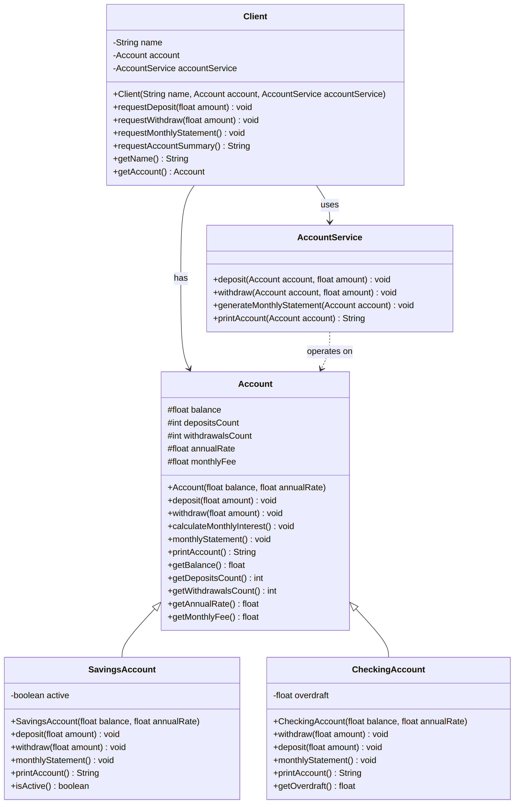
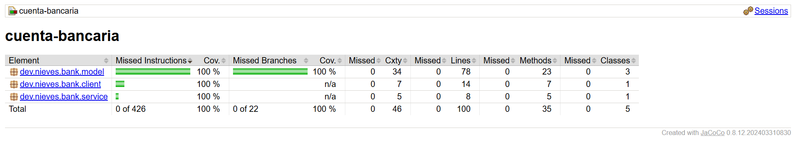
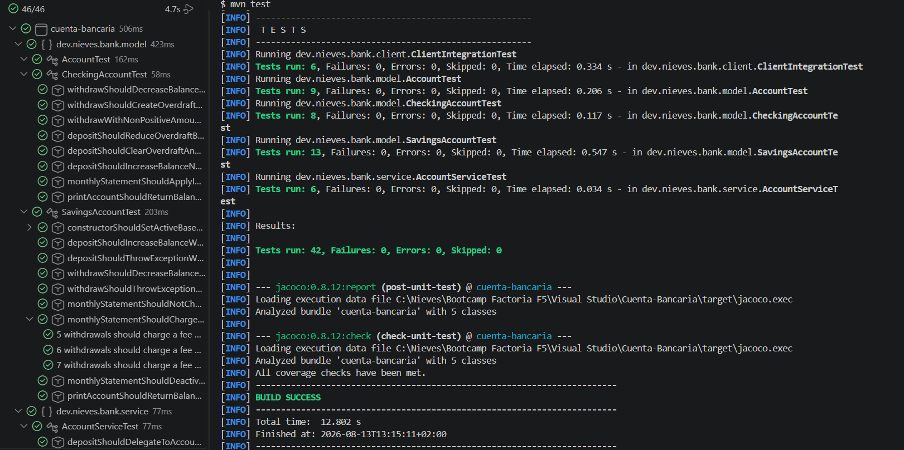

# Cuenta Bancaria

## 🔍 Índice

- [Descripción](#-descripción)
- [Pre-requisitos](#%EF%B8%8F-pre-requisitos)
- [Estructura de carpetas](#-estructura-de-carpetas)
- [Instalación](#%EF%B8%8F-instalación)
- [Capturas](#-capturas)
- [Autora](#%EF%B8%8F-autora)

---

## 📝 Descripción

Este proyecto modela el dominio de una cuenta bancaria mediante herencia y polimorfismo en Java. La clase `Account` (Cuenta) actúa como superclase y define el comportamiento común a cualquier cuenta: consignar, retirar, calcular interés mensual y generar el extracto mensual. A partir de ella se derivan dos subclases:

- **`SavingsAccount`** (Cuenta de Ahorros): solo permite operar mientras la cuenta esté activa (saldo mínimo de 10.000), y cobra una comisión por cada retiro que supere los 4 gratuitos al mes.
- **`CheckingAccount`** (Cuenta Corriente): permite retirar más saldo del disponible, acumulando la diferencia como sobregiro, que se va reduciendo con las siguientes consignaciones.

Sobre el modelo de dominio se apoya una capa de servicio, `AccountService`, que orquesta las operaciones, y una clase `Client` (Cliente) que solicita esas operaciones a través del servicio — reflejando el flujo `cliente → servicio → cuenta` sobre el que se construyeron los tests de integración.

El proyecto no incluye una interfaz de consola: es un ejercicio orientado exclusivamente a practicar herencia, polimorfismo y testing, verificado mediante 42 tests unitarios y de integración con JUnit 5, alcanzando el 100% de cobertura de instrucciones y ramas según JaCoCo.

---

## ⚙️ Pre-requisitos

- Java 21
- Apache Maven
- Git
- Visual Studio Code
- JaCoCo.
---

## 🛠️ Instalación

1. Clonar el repositorio:
```bash
   git clone https://github.com/duran-ni/Cuenta-Bancaria.git
```

2. Entrar en la carpeta del proyecto:
```bash
   cd Cuenta-Bancaria
```
3. Descargar las dependencias y compilar el proyecto:

```bash
mvn compile
```
4. Ejecución de los tests:
```bash
   mvn test
```
---

## 📁 Estructura de carpetas

```
Cuenta-Bancaria/
├── docs/ # Capturas y diagrama UML del proyecto
├── src/
│ ├── main/java/dev/nieves/bank/
│ │ ├── model/ # Dominio: jerarquía de cuentas
│ │ │ ├── Account.java # Superclase: saldo, consignar, retirar, interés, extracto
│ │ │ ├── SavingsAccount.java # Cuenta de ahorros: activa/inactiva, comisión por retiros extra
│ │ │ └── CheckingAccount.java # Cuenta corriente: sobregiro
│ │ ├── service/
│ │ │ └── AccountService.java # Orquesta las operaciones sobre una cuenta
│ │ └── client/
│ │ └── Client.java # Solicita operaciones a través del servicio
│ └── test/java/dev/nieves/bank/
│ ├── model/
│ │ ├── AccountTest.java
│ │ ├── SavingsAccountTest.java
│ │ └── CheckingAccountTest.java
│ ├── service/
│ │ └── AccountServiceTest.java
│ └── client/
│ └── ClientIntegrationTest.java # Test de integración cliente → servicio → cuenta
├── pom.xml
├── .gitignore
└── README.md
```

## 📷 Capturas

### Diagrama UML de clases



### Cobertura de tests (JaCoCo)



### Tests en verde



---

## ✍️ Autora

duran-ni
